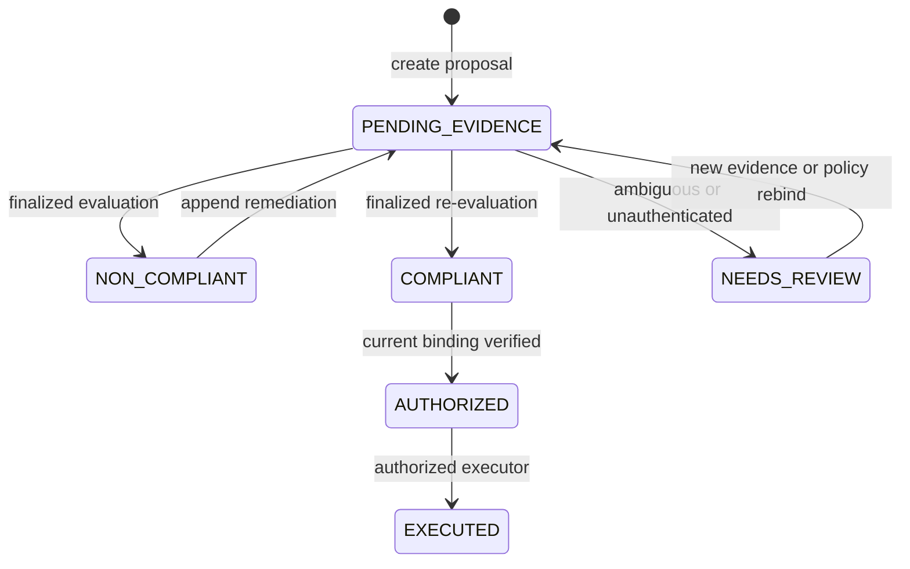

# PolicyGuard

**Consensus-enforced policy compliance for real organizational actions.**

PolicyGuard lets an organization commit versioned, human-written policies and uses GenLayer validators to decide whether a proposed action complies with those policies and authenticated real-world evidence. Deterministic contract logic binds the result to exact policy, proposal, evidence, and approval digests; a stale verdict can never authorize execution.

> Builder Project status: complete and live. The contract, both Full Consensus verdicts, authorization, execution record, and production frontend are verified on GenLayer Studionet.

## Live surfaces

| Surface | Link / value |
|---|---|
| Production application | [policyguard.ansaf1st33.chatgpt.site](https://policyguard.ansaf1st33.chatgpt.site) |
| GitHub repository | [haris4587/PolicyGuard](https://github.com/haris4587/PolicyGuard) |
| Network | GenLayer Studionet · chain `61999` |
| Contract | [`0xdD7D…7964`](https://explorer-studio.genlayer.com/address/0xdD7D1EaC2A2F09602734BC7D6Bb1897ED4487964) |
| Deployment transaction | [`0x0bb9…b6e3`](https://explorer-studio.genlayer.com/tx/0x0bb9dbcd8741512b277c1b83f87eaf9fda07ead0c9231802884dd7480d40b6e3) |
| Missing-audit Full Consensus | [`0xbf95…39d2`](https://explorer-studio.genlayer.com/tx/0xbf95352e985cb1a454baaf44c52e260aefecbffc3fc1ca0186496cddd4e439d2) |
| Corrected Full Consensus | [`0xeb42…b778`](https://explorer-studio.genlayer.com/tx/0xeb42736834489e3402f50ae945e0e6ca1a6972c892e0544d9080082b49f8b778) |

The frontend never labels preview data as a live verdict. It reads finalized state from the verified address in `config/deployment.json`; every live write is signed by the connected browser wallet.

## Primary demonstration

The committed policy says:

> Grants above USD 20,000 require three distinct reviewer approvals and a published security audit.

The demo proposal requests USD 35,000 and includes three approvals. Its first evidence set intentionally omits the security audit.

Verified finalized evaluation #1:

```text
NON_COMPLIANT
Required security audit is missing.
```

The action remained blocked. After the SHA-256-bound audit was appended, evaluation #2 finalized as `COMPLIANT`, linked back to evaluation #1, and preserved both verdicts in the immutable history. The contract then recomputed the complete binding, authorized evaluation #2, and recorded the demo action as `EXECUTED`.

## Why this needs GenLayer

A conventional smart contract can count approvals or compare an amount with a threshold. It cannot safely interpret a human policy, determine whether a document is actually the required audit, reconcile language across a proposal and supporting files, or handle ambiguity without an oracle or centralized reviewer.

PolicyGuard separates those jobs:

- **Deterministic contract layer:** ownership, policy versions, URL constraints, SHA-256 commitments, duplicate approval protection, input revisions, state transitions, stale-verdict prevention, authorization, execution, and append-only history.
- **GenLayer consensus layer:** independent source retrieval, document authentication, policy interpretation, semantic evidence review, normalized findings, safe `NEEDS_REVIEW` fallback, and validator agreement on decision-critical fields.

This follows GenLayer's current independent-verification guidance: validators rerun the same authenticated evaluation and compare status, source state, bindings, requirement sets, and evidence-quality score rather than trusting the leader's JSON shape.

## Lifecycle



Every evidence or approval change increments `input_revision`, clears authorization state, and produces a new evidence/approval-set digest. Policy upgrades require an explicit proposal rebind and new evaluation.

## Contract capabilities

### Organization and policy

- `create_organization`
- `add_reviewer`
- `register_policy_version`
- `rebind_proposal_policy`

### Proposal and evidence

- `create_proposal`
- `add_evidence`
- `approve_proposal`
- `bootstrap_demo` — owner-only, transparent demo attestations

### Consensus and execution

- `start_evaluation`
- `authorize_action`
- `execute_action`

### Auditable reads

- `get_organization`, `get_policy`, `get_proposal`
- `get_evidence`, `get_approval`
- `get_latest_evaluation`, `get_evaluation`, `get_evaluation_history`
- `get_authorization`, `get_audit_event`, `get_recent_audit_event_ids`
- `get_protocol_stats`

## Verdict schema

Each immutable evaluation stores:

- `status`: `COMPLIANT`, `NON_COMPLIANT`, or `NEEDS_REVIEW`
- concise `reason`
- `satisfied_requirements`
- `missing_requirements`
- `violated_requirements`
- exact evidence `citations`
- expected and fetched evidence digests
- evidence-quality score and confidence
- policy version and policy digest
- proposal record and file digests
- approval count and approval-set digest
- evidence-set digest and input revision
- full authorization `binding_digest`
- evaluation sequence and previous-evaluation reference
- evaluator and recorded time

## Security properties

- Public canonical HTTPS URLs only; query strings, fragments, local/private hosts, and malformed paths are rejected.
- Exact lowercase 64-character SHA-256 digests are required.
- Policy, proposal, approval, and evidence bytes are independently fetched and verified inside the non-deterministic block.
- Evidence is surrounded by explicit untrusted-document boundaries and cannot change the evaluator's task.
- Duplicate evidence URL/digest pairs and duplicate reviewer-wallet approvals are rejected.
- Unknown or malformed model output fails closed to `NEEDS_REVIEW`.
- A compliant evaluation does not itself execute anything.
- Authorization recomputes the full binding and rejects stale policy, proposal, evidence, approval, or revision state.
- Execution requires the exact authorized executor wallet.
- Historical policies, evidence, approvals, evaluations, and audit events are never deleted.

See [SECURITY.md](docs/SECURITY.md) for the threat model and trust boundaries.

## Repository layout

```text
contracts/policy_guard.py       GenLayer Intelligent Contract
components/policyguard-app.tsx  wallet-connected application
config/deployment.json          verified network and transaction record
demo/                           commit-pinned policy, proposals, and evidence
docs/                           architecture, deployment, demo, tests, security, submission
scripts/                        source and evidence verification
tests/                          deterministic model and production app tests
```

## Install, test, and build

Requirements: Node.js 22+, npm, and Python 3.12+.

```bash
npm ci
python3 -m pip install -r requirements-dev.txt
npm run typecheck
npm test
```

`npm test` performs contract syntax checks, 18 deterministic lifecycle/security tests, contract-control verification, evidence-hash verification, ESLint, a production build, and production-worker rendering/client-integrity tests.

Run locally:

```bash
cp .env.example .env.local
npm run dev
```

No private key, seed phrase, or wallet secret belongs in this repository. Browser writes use the injected EIP-1193 provider and require a MetaMask signature.

## Stable evidence

The exact demo files and digests are listed in [demo/HASHES.sha256](demo/HASHES.sha256) and machine-checked against [demo/manifest.json](demo/manifest.json). Deployment uses a full Git commit SHA in every raw GitHub URL so a later branch update cannot alter the evidence behind a stored verdict.

## Documentation

- [Architecture](docs/ARCHITECTURE.md)
- [Deployment and verification](docs/DEPLOYMENT.md)
- [Demo runbook](docs/DEMO.md)
- [Testing guide](docs/TESTING.md)
- [Security and threat model](docs/SECURITY.md)
- [Deployment evidence record](EVIDENCE.md)
- [Builder submission draft](docs/SUBMISSION.md)

## Official references

- [GenLayer: Your First Contract](https://docs.genlayer.com/developers/intelligent-contracts/first-contract)
- [Equivalence Principle](https://docs.genlayer.com/developers/intelligent-contracts/equivalence-principle)
- [Web Access](https://docs.genlayer.com/developers/intelligent-contracts/features/web-access)
- [Reading from Intelligent Contracts](https://docs.genlayer.com/developers/decentralized-applications/reading-data)
- [Writing to Intelligent Contracts](https://docs.genlayer.com/developers/decentralized-applications/writing-data)
- [Network Configuration](https://docs.genlayer.com/developers/intelligent-contracts/deploying/network-configuration)

## License

MIT — see [LICENSE](LICENSE).
