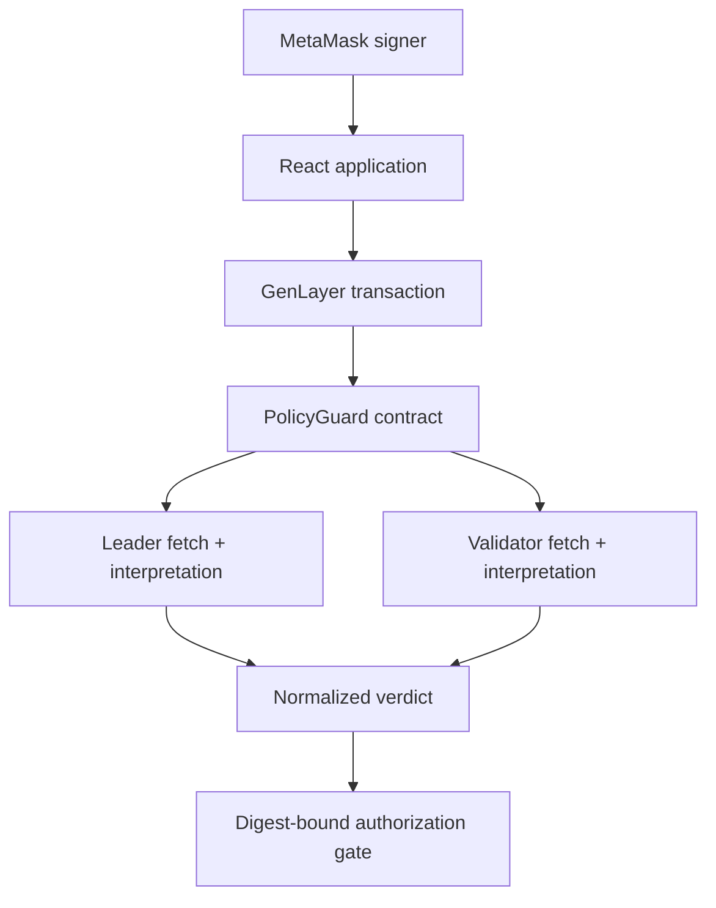

# PolicyGuard architecture

## Design goal

PolicyGuard must make a nuanced, human-policy decision without allowing a model response to become an unchecked execution key. The architecture therefore separates semantic judgment from deterministic authorization.

## Components

### Intelligent Contract

`contracts/policy_guard.py` is the authoritative state machine. Persistent records are stored as canonical JSON in typed `TreeMap[str, str]` collections. Indexes use `DynArray[str]`; counters use fixed-width `u32` values.

The contract owns:

- organizations and registered reviewer wallets;
- sequential, immutable policy versions;
- proposals bound to one policy version and proposal-file digest;
- append-only evidence and approval records;
- append-only consensus evaluations;
- authorization and execution records;
- a global append-only audit event index.

### Validator boundary

`start_evaluation` snapshots the current proposal record and policy. Both leader and validators:

1. Collect the policy, proposal, evidence, and approval-proof URLs.
2. Fetch every source independently.
3. Recalculate the SHA-256 digest of its exact bytes.
4. Apply deterministic fail-closed gates for broken commitments and explicit normalized controls.
5. Interpret the authenticated documents against the human-written policy.
6. Normalize the response to a bounded schema.

The validator compares decision-critical fields: status, source status, policy/proposal commitments, evidence/approval sets, missing requirements, and a bounded evidence-quality score. It does not accept a leader response merely because it is well-formed.

### Frontend

The React/Vite/TypeScript interface uses `genlayer-js@1.1.8`, the stable Studionet SDK line. Reads use `LATEST_FINAL`. Writes use the connected EIP-1193 MetaMask provider with `leaderOnly: false`, and the interface waits for both accepted and finalized lifecycle points while checking execution failure separately.

The case desk keeps a separately loaded `activeProposalId`. Evaluation,
remediation, authorization, execution, evidence, and reviewer-approval actions
all use that loaded ID; the demo identifier is available only through an
explicit demo-load/bootstrap control. Policy setup also exposes the contract's
owner-only `add_reviewer` call and renders the loaded organization's roster.

No secret account or generated private key is embedded. Disconnect clears only local application state because an application cannot silently revoke MetaMask permissions.

## Data commitments

### Proposal digest

The proposal record digest commits:

- proposal and organization IDs;
- policy ID and version;
- action type and description;
- requested USD amount;
- proposal URL and file digest;
- authorized executor.

### Evidence-set digest

Evidence entries are canonicalized by evidence ID and commit type, URL, and SHA-256 digest.

### Approval-set digest

Approval entries are canonicalized by reviewer wallet and commit proof URL, proof digest, and approval mode.

### Authorization binding

The authorization digest commits:

- organization and policy identity;
- policy version and digest;
- proposal digest;
- evidence-set digest;
- approval-set digest and count;
- proposal input revision.

`authorize_action` recomputes this digest. Any changed input makes the latest evaluation stale. `execute_action` checks the authorization binding again.

## State model

| State | Meaning | Allowed next actions |
|---|---|---|
| `PENDING_EVIDENCE` | Proposal exists or inputs changed | add evidence, approve, evaluate |
| `NON_COMPLIANT` | A clear policy requirement failed | append remediation, re-evaluate |
| `NEEDS_REVIEW` | Evidence/authentication/model ambiguity failed closed | append clarification, re-evaluate |
| `COMPLIANT` | Latest evaluation satisfies the policy | authorize, or change input and re-evaluate |
| `AUTHORIZED` | Owner approved the exact compliant binding | execute by named executor |
| `EXECUTED` | Terminal execution record | reads only |

The transaction UI exposes `wallet`, `submitted`, `accepted`, and `finalized` states locally. The contract writes only the final authoritative state produced by consensus.

## Demo bootstrap trust boundary

The owner-only `bootstrap_demo` method exists to make the public reviewer demonstration reproducible with one wallet. It creates three clearly marked `DEMO_ATTESTED` approvals linked to one hash-bound approval bundle. Normal organizations use `add_reviewer` and `approve_proposal`; each reviewer must sign their own transaction and the wallet-address key prevents duplicates. The UI and demo document disclose this distinction.
