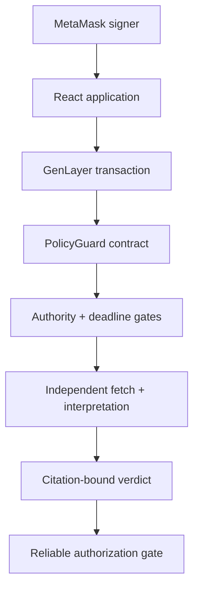

# PolicyGuard architecture

## Design goal

PolicyGuard must make a nuanced, human-policy decision without allowing a model response to become an unchecked execution key. The architecture therefore separates semantic judgment from deterministic authorization.

## Components

### Intelligent Contract

`contracts/policy_guard.py` is the authoritative state machine. Persistent records are stored as canonical JSON in typed `TreeMap[str, str]` collections. Indexes use `DynArray[str]`; counters use fixed-width `u32` values.

The contract owns:

- organizations, registered reviewer wallets, and revocable exact-host source authorities;
- sequential, immutable policy versions;
- proposals bound to one policy version, proposal-file digest, and evidence deadline;
- append-only evidence and approval records;
- append-only consensus evaluations;
- authorization and execution records;
- a global append-only audit event index.

### Validator boundary

`start_evaluation` snapshots the current proposal record and policy. Both leader and validators:

1. Confirm that the stored evidence deadline has closed.
2. Collect the policy, proposal, evidence, and approval-proof URLs.
3. Re-authenticate each exact hostname, issuer wallet, and scope against current contract state.
4. Fetch every source independently and recalculate the SHA-256 digest of its exact bytes.
5. Apply deterministic fail-closed gates for broken commitments and explicit normalized controls.
6. Interpret the authenticated documents against the human-written policy.
7. Accept only citations that exactly match authenticated fetched pages and normalize the response to a bounded schema.

The validator compares decision-critical fields: status, source status, policy/proposal commitments, evidence/approval sets, source-authority digest, deadline state, reliability flags, missing requirements, and a bounded evidence-quality score. It independently rejects a proposed citation that is absent from its own fetched-page set.

### Frontend

The React/Vite/TypeScript interface uses `genlayer-js@1.1.8`, the stable Studionet SDK line. Reads use `LATEST_FINAL`. Writes use the connected EIP-1193 MetaMask provider with `leaderOnly: false`, and the interface waits for both accepted and finalized lifecycle points while checking execution failure separately.

The case desk keeps a separately loaded `activeProposalId`. Evaluation,
remediation, authorization, execution, evidence, and reviewer-approval actions
all use that loaded ID; the demo identifier is available only through an
explicit demo-load/bootstrap control. Policy setup also exposes the contract's
owner-only `add_reviewer` and `register_source_authority` calls and renders the loaded organization's roster. Proposal creation records a deadline; remediation opens a new recorded future deadline rather than bypassing the original close.

No secret account or generated private key is embedded. Disconnect clears only local application state because an application cannot silently revoke MetaMask permissions.

## Data commitments

### Proposal digest

The proposal record digest commits:

- proposal and organization IDs;
- policy ID and version;
- action type and description;
- requested USD amount;
- proposal URL and file digest;
- authorized executor.
- proposal source-authority ID;
- evidence deadline and deadline revision.

### Evidence-set digest

Evidence entries are canonicalized by evidence ID and commit type, URL, SHA-256 digest, source-authority ID, and issuer wallet.

### Approval-set digest

Approval entries are canonicalized by reviewer wallet and commit proof URL, proof digest, approval mode, source-authority ID, and issuer wallet.

### Authorization binding

The authorization digest commits:

- organization and policy identity;
- policy version and digest;
- proposal digest;
- evidence-set digest;
- approval-set digest and count;
- proposal input revision.
- evidence deadline and deadline revision;
- current source-authority digest.

`authorize_action` recomputes this digest and requires `reliable_adjudication`, valid fetched-page citations, and an evaluation timestamp at or after the bound deadline. Any changed input or revoked authority makes the latest evaluation stale. `execute_action` checks both reliability and the authorization binding again.

## State model

| State | Meaning | Allowed next actions |
|---|---|---|
| `PENDING_EVIDENCE` | Proposal exists, a window is open, or inputs changed | add authenticated evidence/approval before deadline; evaluate after deadline |
| `NON_COMPLIANT` | A reliable post-deadline requirement failed | open a recorded remediation window |
| `NEEDS_REVIEW` | Source, citation, or model ambiguity failed closed | open a recorded remediation window |
| `COMPLIANT` | Latest evaluation satisfies the policy | authorize, or change input and re-evaluate |
| `AUTHORIZED` | Owner approved the exact compliant binding | execute by named executor |
| `EXECUTED` | Terminal execution record | reads only |

The transaction UI exposes `wallet`, `submitted`, `accepted`, and `finalized` states locally. The contract writes only the final authoritative state produced by consensus.

## Demo bootstrap trust boundary

The owner-only `bootstrap_demo` method exists to make the public reviewer demonstration reproducible with one wallet. It creates explicit demo source authorities and three clearly marked `DEMO_ATTESTED` approvals linked to one hash-bound approval bundle. Its initial evidence deadline is closed so the first evaluation is not premature. Normal organizations register each issuer authority, use `add_reviewer` and `approve_proposal`, and require every reviewer to sign their own transaction. The UI and demo document disclose this distinction.
